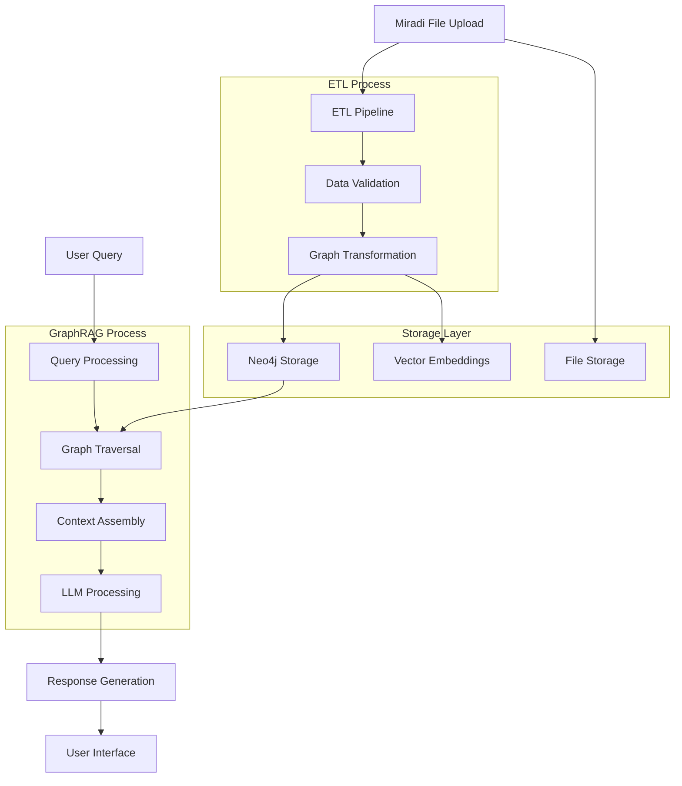
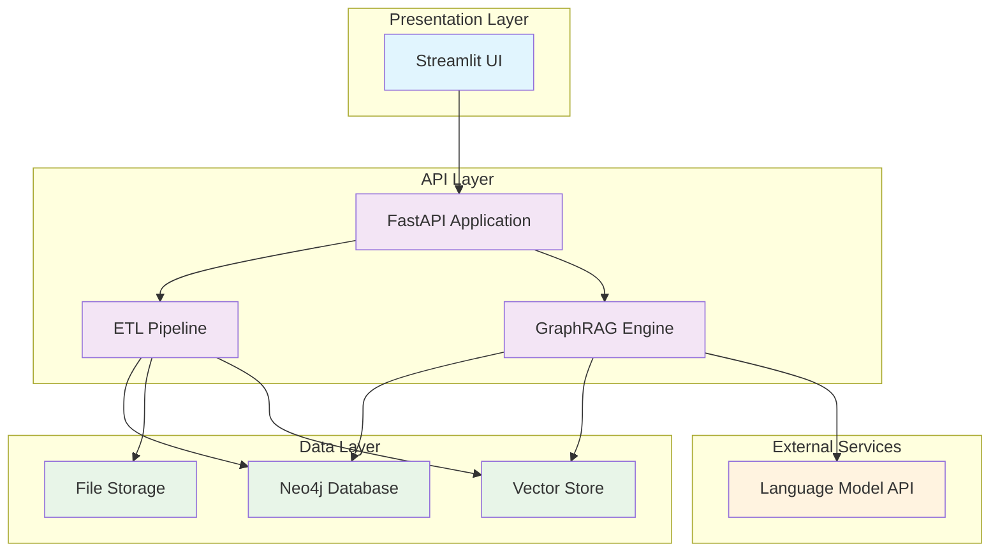

# Miradi Co-Pilot Architecture Overview

## System Purpose

Miradi Co-Pilot is an intelligent assistant system designed to process and analyze Miradi conservation project files, enabling users to query complex project data through natural language interactions. The system transforms structured Miradi project data into a graph-based knowledge representation, allowing for sophisticated relationship analysis and context-aware responses using GraphRAG (Graph Retrieval-Augmented Generation) techniques.

The primary goals of the system are to:
- **Simplify Data Access**: Enable non-technical users to query complex conservation project data using natural language
- **Enhance Insights**: Leverage graph relationships to provide deeper insights into project interconnections
- **Improve Decision Making**: Provide contextual, relationship-aware responses that consider the full project ecosystem
- **Scale Knowledge**: Handle multiple Miradi projects and enable cross-project analysis

## High-Level Architecture

The system follows a modern 3-tier architecture pattern optimized for graph-based data processing and AI-powered querying:

### Data Tier
- **Neo4j Graph Database**: Stores Miradi project data as interconnected nodes and relationships
- **File Storage**: Raw Miradi files and processed artifacts
- **Vector Embeddings**: Graph-aware embeddings for semantic search

### API Tier
- **FastAPI Application**: RESTful API for data ingestion, processing, and querying
- **ETL Pipeline**: Processes Miradi files and populates the graph database
- **GraphRAG Engine**: Combines graph traversal with LLM capabilities for intelligent responses

### Presentation Tier
- **Streamlit UI**: Interactive web interface for file uploads and natural language querying
- **Visualization Components**: Graph visualizations and project insights dashboards

### Technology Choices and Rationale

| Component | Technology | Rationale |
|-----------|------------|-----------|
| **Database** | Neo4j | Native graph operations, ACID compliance, Cypher query language |
| **API Framework** | FastAPI | High performance, automatic API documentation, async support |
| **UI Framework** | Streamlit | Rapid prototyping, data science friendly, minimal frontend complexity |
| **Language** | Python 3.11+ | Rich ecosystem for data processing and AI/ML libraries |
| **Containerization** | Docker | Consistent deployment, easy Neo4j setup, environment isolation |

## Core Components

### 1. ETL Pipeline
**Purpose**: Transform Miradi XML/JSON files into graph structures suitable for Neo4j storage.

**Design Principles**:
- **Incremental Processing**: Handle updates to existing projects without full reprocessing
- **Schema Validation**: Ensure data integrity during transformation
- **Relationship Mapping**: Preserve and enhance relationships between Miradi entities
- **Metadata Enrichment**: Add processing timestamps, data lineage, and quality metrics

**Key Responsibilities**:
- Parse Miradi file formats (XML, JSON)
- Extract entities (projects, strategies, results chains, etc.)
- Map relationships between entities
- Generate graph-optimized data structures
- Handle data validation and error recovery

### 2. Graph Database (Neo4j)
**Why Neo4j**: 
- **Native Graph Processing**: Optimized for relationship traversal and pattern matching
- **Cypher Query Language**: Intuitive graph query syntax
- **ACID Compliance**: Ensures data consistency for complex operations
- **Scalability**: Handles large, interconnected datasets efficiently
- **Visualization**: Built-in graph visualization capabilities

**Schema Design**:
- **Node Types**: Project, Strategy, Result, Threat, Target, Activity, etc.
- **Relationship Types**: CONTRIBUTES_TO, ADDRESSES, DEPENDS_ON, PART_OF, etc.
- **Properties**: Rich metadata on both nodes and relationships
- **Indexes**: Optimized for common query patterns

### 3. RAG System (GraphRAG Approach)
**GraphRAG vs Traditional RAG**:
- **Context Awareness**: Leverages graph relationships for richer context
- **Multi-hop Reasoning**: Follows relationship chains for complex queries
- **Structured Knowledge**: Combines structured graph data with unstructured text
- **Relationship-Aware Retrieval**: Retrieves not just similar content but related entities

**Architecture**:
- **Graph Traversal**: Uses Cypher queries to explore relevant subgraphs
- **Embedding Generation**: Creates graph-aware embeddings for semantic search
- **Context Assembly**: Combines graph structure with textual content
- **LLM Integration**: Provides structured context to language models

### 4. API Layer (FastAPI)
**Design Philosophy**: Clean, async-first API design with comprehensive documentation and type safety.

**Key Endpoints**:
- **File Management**: Upload, process, and manage Miradi files
- **Graph Operations**: Query and manipulate graph data
- **RAG Interface**: Natural language query processing
- **Analytics**: Project insights and relationship analysis

**Features**:
- **Automatic Documentation**: OpenAPI/Swagger integration
- **Type Safety**: Pydantic models for request/response validation
- **Async Support**: Non-blocking operations for file processing
- **Error Handling**: Comprehensive error responses and logging

### 5. UI Layer (Streamlit)
**Why Streamlit**:
- **Rapid Development**: Quick iteration for data science applications
- **Python Native**: Seamless integration with backend logic
- **Interactive Components**: Built-in widgets for file uploads and visualizations
- **Minimal Frontend Complexity**: Focus on functionality over UI complexity

**Key Features**:
- **File Upload Interface**: Drag-and-drop Miradi file processing
- **Natural Language Query**: Chat-like interface for project questions
- **Graph Visualization**: Interactive project relationship displays
- **Results Dashboard**: Structured presentation of query results

## Data Flow Overview



### Detailed Flow Steps

1. **File Ingestion**: User uploads Miradi file through Streamlit interface
2. **ETL Processing**: FastAPI receives file, validates format, and triggers ETL pipeline
3. **Graph Population**: Processed data is stored in Neo4j with proper relationships
4. **Query Processing**: User submits natural language query
5. **Graph Traversal**: System identifies relevant subgraph using Cypher queries
6. **Context Assembly**: Combines graph structure with textual content
7. **LLM Integration**: Structured context is provided to language model
8. **Response Generation**: AI generates contextually aware response
9. **Result Presentation**: Response is displayed with supporting visualizations

## Key Design Decisions

### Why Graph Database Over Relational?

**Relationship-First Modeling**:
- Miradi projects are inherently relationship-heavy (strategies → results → threats)
- Graph databases excel at traversing complex relationship networks
- JOIN operations in SQL become expensive with deep relationship queries
- Graph queries (Cypher) are more intuitive for relationship-based questions

**Performance Benefits**:
- Constant-time relationship traversal regardless of data size
- No need for complex JOIN operations
- Optimized for pattern matching and path finding
- Better performance for "friends of friends" type queries

### Why GraphRAG Over Traditional RAG?

**Enhanced Context Understanding**:
- Traditional RAG relies on semantic similarity alone
- GraphRAG incorporates structural relationships for richer context
- Better handling of multi-entity queries
- Improved accuracy for complex, interconnected questions

**Structured Knowledge Integration**:
- Combines the best of structured (graph) and unstructured (text) data
- Maintains data relationships during retrieval
- Enables reasoning across multiple relationship hops
- Provides explainable AI through graph paths

### Scalability Considerations

**Horizontal Scaling**:
- Neo4j clustering for database scalability
- FastAPI supports async operations and can be load-balanced
- Streamlit can be deployed behind reverse proxy for multiple instances
- Containerized architecture enables cloud deployment

**Performance Optimization**:
- Graph indexes on frequently queried properties
- Caching layer for common queries
- Batch processing for large file uploads
- Async processing for long-running ETL operations

**Data Management**:
- Incremental updates to avoid full reprocessing
- Data versioning for project evolution tracking
- Automated backup and recovery procedures
- Monitoring and alerting for system health

## Component Relationships



This architecture provides a robust, scalable foundation for intelligent analysis of Miradi conservation projects, leveraging modern graph database technology and AI capabilities to deliver meaningful insights to conservation professionals.

## Implementation Status

### Schema Analysis Results

The foundation of our parser implementation is based on comprehensive empirical analysis of real-world Miradi conservation projects:

- **Projects Analyzed**: 11 diverse conservation projects from different organizations and regions
- **Unique Elements Discovered**: 689 distinct XML element types across all projects
- **Total Element Instances**: 619,358 individual elements processed and analyzed
- **Schema Coverage**: Complete mapping of element frequency and usage patterns

**4-Tier Implementation Strategy**:
- **Must-Support (173 elements)**: Found in 100% of projects - essential for basic functionality
- **Should-Support (65 elements)**: Found in 75%+ of projects - high-value features
- **Optional (267 elements)**: Found in 25-74% of projects - conditional implementation
- **Edge Cases (184 elements)**: Found in <25% of projects - special handling required

This empirical approach ensures our parser can handle the full spectrum of real-world Miradi projects while prioritizing development effort for maximum impact. Detailed analysis and implementation guidance is available in [docs/schemas/parser-requirements.md](schemas/parser-requirements.md).

### Parser Implementation

The **MiradiParser** class has been fully implemented with comprehensive support for Miradi project files:

**Core Features**:
- **173 Must-Support Elements**: Complete implementation of all elements found in every analyzed project
- **Configurable Unknown Element Handling**: Four strategies for handling unexpected elements:
  - `LOG`: Log warnings and continue processing
  - `ERROR`: Raise exceptions for unknown elements
  - `STORE`: Preserve unknown elements for future analysis
  - `IGNORE`: Silently skip unknown elements
- **Comprehensive Validation**: Validates presence of required elements and data integrity
- **XML Namespace Support**: Correctly handles Miradi's XML namespace conventions
- **ZIP File Processing**: Automatically extracts and processes .xmpz2 files

**Parser Architecture**:
```python
# Abstract base class defining extraction interface
class BaseParser(ABC):
    def extract_project_metadata(self, root: ET.Element) -> Dict[str, Any]
    def extract_conservation_targets(self, root: ET.Element) -> List[ParsedElement]
    def extract_threats(self, root: ET.Element) -> List[ParsedElement]
    def extract_strategies(self, root: ET.Element) -> List[ParsedElement]
    def extract_activities(self, root: ET.Element) -> List[ParsedElement]
    def extract_results_chains(self, root: ET.Element) -> List[ParsedElement]
    def extract_conceptual_models(self, root: ET.Element) -> List[ParsedElement]
    def parse_all(self, file_path: Union[str, Path]) -> Dict[str, Any]

# Concrete implementation with 173 must-support elements
class MiradiParser(BaseParser):
    # Full implementation with configurable options
```

**Command-Line Interface**:
```bash
# Basic parsing
python src/etl/miradi_parser.py project.xmpz2

# Advanced options with custom handling
python src/etl/miradi_parser.py project.xmpz2 \
    --output results.json \
    --unknown-handling store \
    --summary-only
```

**Error Handling & Validation**:
- **Required Element Validation**: Ensures presence of 7 critical elements for basic functionality
- **Schema Compliance**: Validates against empirically-derived element requirements
- **Graceful Degradation**: Continues processing even when encountering unknown elements
- **Detailed Error Messages**: Provides actionable feedback for parsing failures
- **File Format Validation**: Validates ZIP structure and XML format before processing

### Current Capabilities

The implemented parser provides comprehensive Miradi project processing capabilities:

**File Processing**:
- **Universal Compatibility**: Can parse any standard Miradi .xmpz2 file
- **Robust Extraction**: Handles all core conservation elements (targets, strategies, threats, results)
- **Metadata Preservation**: Maintains project metadata, UUIDs, and referential integrity
- **Rich Data Structures**: Extracts hierarchical relationships and nested element data

**Conservation Element Extraction**:
- **Biodiversity Targets**: Complete extraction with IDs, names, UUIDs, and viability data
- **Conservation Strategies**: Full strategy data including activities and implementation details
- **Activities (Tasks)**: Comprehensive activity extraction with identifiers and relationships
- **Threats and Causes**: Comprehensive threat analysis with ratings and relationships
- **Results Chains**: Complete results chain structure with diagram relationships
- **Conceptual Models**: Full conceptual model data with factor and link information
- **Project Metadata**: Essential project information and configuration settings

**Technical Capabilities**:
- **XML Namespace Handling**: Correctly processes Miradi's namespaced XML structure
- **ZIP Archive Processing**: Seamlessly extracts and processes .xmpz2 archive files
- **Memory Efficient**: Processes large projects without excessive memory usage
- **Statistics Tracking**: Comprehensive parsing statistics and element coverage metrics
- **Type Safety**: Full type annotations for better IDE support and error prevention

**Parsing Statistics & Coverage**:
```python
# Example parsing summary
{
    'total_elements': 15420,
    'element_breakdown': {
        'must_support': 12890,     # 83.6% coverage
        'should_support': 1890,    # 12.3% coverage
        'optional': 520,           # 3.4% coverage
        'edge_case': 85,           # 0.6% coverage
        'unknown': 35              # 0.2% coverage
    },
    'coverage': {
        'must_support_coverage': 83.6,
        'known_element_coverage': 99.8
    }
}
```

**Integration Ready**:
- **Neo4j Preparation**: Extracted data structures are optimized for graph database storage
- **Relationship Mapping**: Preserves all entity relationships for graph representation
- **UUID Preservation**: Maintains referential integrity for cross-entity relationships
- **Extensible Design**: Easy to add new extraction methods for additional element types
- **Error Recovery**: Robust error handling ensures partial parsing success even with data issues

The parser implementation provides a solid foundation for the ETL pipeline, enabling reliable transformation of Miradi conservation projects into graph-ready data structures for Neo4j storage and GraphRAG processing.
