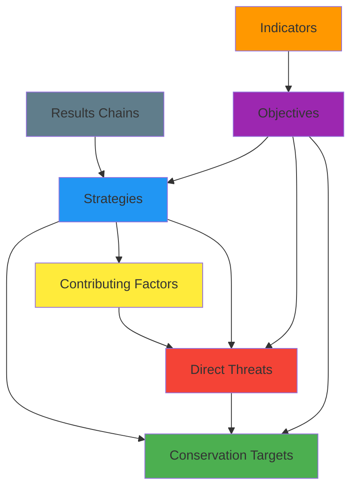

# Miradi Domain Model

## Overview

The Miradi domain model represents the conceptual framework used in conservation planning and adaptive management. This model captures the complex relationships between conservation targets, threats, strategies, and outcomes that form the foundation of effective conservation projects.

Understanding this domain model is crucial for:
- **Data Processing**: Correctly parsing and structuring Miradi project files
- **Graph Design**: Creating meaningful node types and relationships in Neo4j
- **Query Understanding**: Interpreting user questions in conservation context
- **Result Interpretation**: Providing contextually appropriate responses

## Core Concepts

### Conservation Targets
**Definition**: The species, habitats, or ecological systems that a conservation project aims to protect or restore.

**Characteristics**:
- Represent the fundamental "what" of conservation
- Can be hierarchical (ecosystem → habitat → species)
- Have measurable attributes (population size, habitat extent, condition)
- Form the foundation for all other planning elements

**Examples**:
- **Species Target**: "Amur Leopard (*Panthera pardus orientalis*)"
  - Population: ~120 individuals
  - Geographic scope: Russian Far East and Northeast China
  - Key attributes: Breeding success, territory size, genetic diversity

- **Habitat Target**: "Temperate Broadleaf Forest"
  - Extent: 50,000 hectares
  - Condition: Forest connectivity, canopy cover, understory diversity
  - Geographic scope: Protected area boundaries

- **Ecosystem Target**: "Coral Reef System"
  - Health indicators: Coral cover, fish diversity, water quality
  - Extent: 15 km² of reef area
  - Key processes: Nutrient cycling, recruitment, resilience

### Direct Threats
**Definition**: Human activities or processes that directly harm, degrade, or destroy conservation targets.

**Characteristics**:
- Immediate causes of target degradation
- Observable and measurable impacts
- Can be ranked by severity, scope, and irreversibility
- Often symptoms of deeper root causes

**Examples**:
- **Habitat Destruction**: "Illegal Logging"
  - Impact: 500 hectares/year forest loss
  - Scope: 30% of target habitat affected
  - Severity: High (permanent habitat loss)
  - Timing: Ongoing, increasing trend

- **Overexploitation**: "Unsustainable Fishing"
  - Impact: 40% decline in target fish populations
  - Methods: Bottom trawling, overfishing of spawning grounds
  - Scope: 80% of reef system affected
  - Irreversibility: Medium (populations can recover with management)

- **Pollution**: "Agricultural Runoff"
  - Contaminants: Nitrogen, phosphorus, pesticides
  - Impact: Eutrophication, algal blooms
  - Scope: 60% of watershed affected
  - Timing: Seasonal peaks during planting/harvesting

### Contributing Factors
**Definition**: The underlying social, economic, political, or institutional root causes that enable or drive direct threats.

**Characteristics**:
- Indirect causes that must be addressed for long-term success
- Often complex and interconnected
- May be outside the direct control of conservation organizations
- Require different types of interventions than direct threats

**Examples**:
- **Economic Factors**: "Lack of Alternative Livelihoods"
  - Context: Rural communities dependent on forest resources
  - Manifestation: Drives illegal logging and poaching
  - Complexity: Requires economic development, not just enforcement

- **Governance Issues**: "Weak Law Enforcement"
  - Context: Insufficient resources for protected area management
  - Manifestation: Enables illegal activities to continue
  - Solutions: Capacity building, policy reform, funding

- **Social Factors**: "Limited Conservation Awareness"
  - Context: Local communities unaware of ecosystem services
  - Manifestation: Lack of support for conservation initiatives
  - Solutions: Education, community engagement, benefit-sharing

### Strategies
**Definition**: Interventions or actions designed to mitigate threats, address contributing factors, or directly benefit conservation targets.

**Characteristics**:
- Represent the "how" of conservation action
- Can target threats, contributing factors, or targets directly
- Should be specific, measurable, and time-bound
- Often work in combination for maximum effectiveness

**Examples**:
- **Threat Reduction Strategy**: "Anti-Poaching Patrols"
  - Target: Illegal hunting of endangered species
  - Activities: Regular patrols, ranger training, equipment provision
  - Expected outcome: 50% reduction in poaching incidents
  - Timeline: 3-year implementation period

- **Contributing Factor Strategy**: "Alternative Livelihood Development"
  - Target: Economic dependence on forest resources
  - Activities: Ecotourism training, sustainable agriculture, microfinance
  - Expected outcome: 200 families with alternative income sources
  - Timeline: 5-year program with phased implementation

- **Target Enhancement Strategy**: "Habitat Restoration"
  - Target: Degraded forest habitat
  - Activities: Native species planting, invasive species removal
  - Expected outcome: 1,000 hectares of restored habitat
  - Timeline: 10-year restoration program

### Results Chains
**Definition**: Logical frameworks that connect strategies to their intended outcomes through a series of intermediate results, representing the theory of change for conservation interventions.

**Characteristics**:
- Show causal linkages from activities to ultimate outcomes
- Include assumptions about how change will occur
- Allow for monitoring and adaptive management
- Can be simple linear chains or complex networks

**Example - Anti-Poaching Results Chain**:
```
Strategy: Anti-Poaching Patrols
    ↓
Intermediate Result 1: Increased ranger presence in critical areas
    ↓
Intermediate Result 2: Higher detection rate of illegal activities
    ↓
Intermediate Result 3: Reduced poaching incidents
    ↓
Threat Reduction: Decreased illegal hunting pressure
    ↓
Target Outcome: Stable or increasing wildlife populations
```

**Assumptions**:
- Rangers will be properly trained and equipped
- Poachers will be deterred by increased enforcement
- Legal system will prosecute offenders effectively
- Community support for anti-poaching efforts will continue

### Indicators
**Definition**: Measurable variables that provide evidence of progress toward objectives or changes in the status of targets, threats, and strategies.

**Characteristics**:
- Must be specific, measurable, achievable, relevant, and time-bound (SMART)
- Can be quantitative or qualitative
- Should be cost-effective to monitor
- Linked to specific objectives or results

**Types and Examples**:

**Target Status Indicators**:
- "Forest cover in protected area" (hectares, % change)
- "Breeding pairs of target bird species" (count, trend)
- "Water quality index" (chemical parameters, rating scale)

**Threat Reduction Indicators**:
- "Number of illegal logging incidents per month" (count, trend)
- "Fishing pressure index" (boats/day, catch per unit effort)
- "Pollution load in watershed" (kg/year of nutrients)

**Strategy Implementation Indicators**:
- "Number of rangers trained and deployed" (count, % of target)
- "Hectares under restoration" (area, % of planned)
- "Community members participating in programs" (count, demographics)

### Objectives
**Definition**: Specific, measurable goals that define the desired future state for conservation targets, threat reduction, or strategy implementation.

**Characteristics**:
- Provide clear targets for achievement
- Should be SMART (Specific, Measurable, Achievable, Relevant, Time-bound)
- Linked to indicators for monitoring progress
- Can be nested hierarchically (goals → objectives → sub-objectives)

**Examples**:

**Target Objectives**:
- "Maintain stable population of 150+ Amur leopards by 2030"
- "Restore 2,000 hectares of degraded forest habitat by 2028"
- "Achieve 'Good' ecological condition rating for coral reef system by 2027"

**Threat Reduction Objectives**:
- "Reduce illegal logging incidents by 75% within 3 years"
- "Decrease fishing pressure to sustainable levels (MSY) by 2026"
- "Eliminate agricultural runoff from 80% of watershed by 2029"

**Strategy Objectives**:
- "Train and deploy 50 community rangers by end of 2025"
- "Establish alternative livelihoods for 300 households by 2027"
- "Achieve 90% community awareness of conservation benefits by 2026"

## Relationships

The Miradi domain model is built on a network of relationships that capture the complex interactions in conservation systems:

### Primary Relationships

**Threats AFFECT Targets**
- **Nature**: Direct negative impact relationship
- **Attributes**: Severity (High/Medium/Low), Scope (% of target affected), Irreversibility
- **Example**: "Illegal Logging AFFECTS Temperate Forest" (Severity: High, Scope: 30%, Irreversibility: Medium)

**Contributing Factors CONTRIBUTE TO Threats**
- **Nature**: Causal relationship showing root causes
- **Attributes**: Contribution level, directness of influence
- **Example**: "Poverty CONTRIBUTES TO Illegal Logging" (High contribution, direct influence)

**Strategies MITIGATE Threats**
- **Nature**: Intervention relationship aimed at threat reduction
- **Attributes**: Expected effectiveness, implementation timeline
- **Example**: "Anti-Poaching Patrols MITIGATE Illegal Hunting" (High effectiveness expected)

**Strategies ADDRESS Contributing Factors**
- **Nature**: Intervention targeting root causes
- **Attributes**: Approach type (direct/indirect), expected timeline for impact
- **Example**: "Livelihood Programs ADDRESS Poverty" (Indirect approach, long-term impact)

**Strategies ENHANCE Targets**
- **Nature**: Direct positive intervention for target benefit
- **Attributes**: Enhancement type (restoration, protection, management)
- **Example**: "Habitat Restoration ENHANCES Forest Ecosystem" (Restoration type)

**Indicators MEASURE Objectives**
- **Nature**: Monitoring relationship providing evidence of progress
- **Attributes**: Measurement frequency, data source, reliability
- **Example**: "Population Count MEASURES Population Objective" (Annual frequency, field surveys)

**Objectives DEFINE Target States**
- **Nature**: Goal-setting relationship specifying desired outcomes
- **Attributes**: Target value, timeline, priority level
- **Example**: "Population Objective DEFINES Target State" (150 individuals, by 2030, high priority)

**Results Chains CONNECT Strategies to Outcomes**
- **Nature**: Logical linkage showing theory of change
- **Attributes**: Assumption strength, evidence base, complexity
- **Example**: "Patrol Strategy CONNECTS TO Population Outcome" (Strong assumptions, good evidence)

### Relationship Hierarchy



### Complex Relationship Patterns

**Threat Networks**: Multiple contributing factors can drive a single threat, and single factors can contribute to multiple threats.

**Strategy Portfolios**: Comprehensive conservation requires multiple strategies working together, often with synergistic effects.

**Cascading Effects**: Changes in one part of the system can have ripple effects throughout the conservation landscape.

**Feedback Loops**: Successful conservation outcomes can reinforce positive behaviors and reduce contributing factors.

## Miradi-Specific Terminology

### Planning and Assessment Terms

**Conceptual Model**: Visual representation of the key conservation targets, direct threats, contributing factors, and their relationships within a project area.

**Situation Analysis**: Comprehensive assessment of conservation context, including target status, threat analysis, and stakeholder mapping.

**Theory of Change**: Logical framework explaining how and why a particular strategy or set of strategies will lead to desired conservation outcomes.

**Adaptive Management**: Systematic approach to improving conservation effectiveness through learning from implementation experience and adjusting strategies accordingly.

### Measurement and Monitoring Terms

**Key Ecological Attributes (KEAs)**: The aspects of a conservation target's ecology that, if present, define a healthy target and, if missing or altered, would lead to the outright loss or extreme degradation of that target.

**Viability**: The ability of a conservation target to persist for many generations or over long time periods.

**Stress**: Impaired aspects of a conservation target that result directly or indirectly from human activities.

**Source**: The proximate human activity that directly causes stress to a conservation target.

### Strategic Planning Terms

**Conservation Action Plan (CAP)**: Comprehensive strategic plan that includes situation analysis, strategy development, and monitoring framework.

**Results Chain**: Graphical depiction of the causal logic of how a strategy or set of strategies will contribute to conservation goals.

**Assumption**: Belief about conditions that must hold true for a strategy to succeed but are not under direct control of the project team.

**Intermediate Result**: Outcome that occurs between strategy implementation and ultimate conservation goals, representing steps in the theory of change.

### Monitoring Terms

**Status**: Current condition of a conservation target, threat, or strategy implementation.

**Trend**: Direction and rate of change in status over time.

**Scope**: Geographic or population extent affected by a threat or reached by a strategy.

**Severity**: Level of damage or degradation caused by a threat within its scope.

**Irreversibility**: Degree to which effects of a threat can be reversed if the threat is eliminated.

## Example Scenarios

### Scenario 1: Marine Protected Area

**Conservation Target**: "Coral Reef Ecosystem"
- **Key Attributes**: Coral cover (>60%), fish diversity (>200 species), water quality (excellent)
- **Current Status**: Declining (coral cover 45%, fish diversity 150 species)

**Direct Threat**: "Overfishing"
- **Scope**: 80% of reef area affected
- **Severity**: High (commercial fish populations declined 60%)
- **Trend**: Increasing pressure from growing fishing fleet

**Contributing Factor**: "Lack of Alternative Livelihoods"
- **Context**: 500 fishing families dependent on reef resources
- **Economic pressure**: Average income below poverty line
- **Limited options**: Few alternative employment opportunities

**Strategy**: "Community-Based Fisheries Management"
- **Approach**: Co-management with local fishing communities
- **Activities**: Fishing quotas, gear restrictions, no-take zones
- **Alternative livelihoods**: Ecotourism, aquaculture development

**Results Chain**:
```
Community engagement → Fishing regulations accepted → 
Reduced fishing pressure → Fish populations recover → 
Coral reef ecosystem health improves
```

**Indicators**:
- Fish biomass (kg/hectare)
- Coral cover percentage
- Number of fishing boats per day
- Community compliance rate with regulations

**Objectives**:
- "Increase fish biomass to 500 kg/hectare by 2028"
- "Restore coral cover to 65% by 2030"
- "Achieve 90% community compliance with fishing regulations by 2026"

### Scenario 2: Forest Conservation

**Conservation Target**: "Old-Growth Forest"
- **Key Attributes**: Canopy cover (>80%), tree age (>200 years), biodiversity index
- **Current Status**: Fragmented (60% original extent remaining)

**Direct Threat**: "Illegal Logging"
- **Scope**: 40% of forest area at risk
- **Severity**: High (100 hectares lost annually)
- **Methods**: Selective cutting of valuable timber species

**Contributing Factors**:
1. **"Weak Law Enforcement"**
   - Insufficient rangers (1 per 10,000 hectares)
   - Limited equipment and training
   - Corruption in enforcement chain

2. **"High Timber Prices"**
   - International demand for rare hardwoods
   - Premium prices incentivize illegal harvesting
   - Limited legal timber alternatives

**Strategies**:
1. **"Enhanced Protection"**
   - Increase ranger patrols
   - Install camera traps and sensors
   - Strengthen prosecution of offenders

2. **"Sustainable Forestry Alternatives"**
   - Certified timber operations outside protected areas
   - Community forestry programs
   - Payment for ecosystem services

**Results Chain for Enhanced Protection**:
```
Ranger training → Increased patrol frequency → 
Higher detection rate → More arrests → 
Deterrent effect → Reduced illegal logging → 
Forest habitat protected
```

**Indicators**:
- Forest cover change (hectares/year)
- Number of illegal logging incidents detected
- Ranger patrol frequency (patrols/month)
- Prosecution rate of offenders

**Objectives**:
- "Reduce forest loss to <10 hectares/year by 2027"
- "Achieve 95% forest cover retention by 2030"
- "Increase ranger patrol coverage to 80% of forest area monthly"

### Scenario 3: Species Conservation

**Conservation Target**: "Migratory Bird Species"
- **Key Attributes**: Population size, breeding success, migration route integrity
- **Current Status**: Declining (30% population decrease over 10 years)

**Direct Threats**:
1. **"Habitat Loss at Stopover Sites"**
   - Wetland drainage for agriculture
   - Urban development in coastal areas
   - 60% of critical stopover habitat lost

2. **"Climate Change Impacts"**
   - Shifting weather patterns affect migration timing
   - Food availability mismatches
   - Extreme weather events increase mortality

**Contributing Factors**:
1. **"Agricultural Expansion"**
   - Economic incentives for wetland conversion
   - Lack of conservation incentives for farmers
   - Weak wetland protection policies

2. **"Urban Development Pressure"**
   - Coastal property values driving development
   - Limited land use planning
   - Inadequate environmental impact assessment

**Strategies**:
1. **"Habitat Protection and Restoration"**
   - Acquire critical stopover sites
   - Restore degraded wetlands
   - Create habitat corridors

2. **"Policy and Incentive Programs"**
   - Conservation easements for farmers
   - Wetland banking systems
   - Strengthen environmental regulations

**Results Chain for Habitat Protection**:
```
Site acquisition → Habitat restoration → 
Increased stopover capacity → Improved migration success → 
Higher breeding success → Population recovery
```

**Indicators**:
- Bird population counts at breeding and wintering sites
- Habitat area protected (hectares)
- Migration route completion rates
- Breeding success rates (fledglings per pair)

**Objectives**:
- "Stabilize population at 50,000 individuals by 2029"
- "Protect 5,000 hectares of critical stopover habitat by 2027"
- "Achieve 85% migration route completion rate by 2028"

These scenarios illustrate how the Miradi domain model captures the complexity of real-world conservation challenges and provides a structured framework for developing effective conservation strategies.
