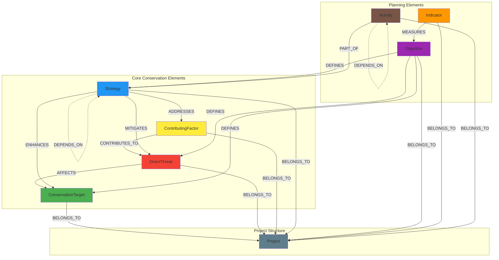

# Neo4j Graph Schema Design

## Overview

This document defines the Neo4j graph schema for the Miradi Co-Pilot system, translating the conservation domain model into a concrete database structure. The schema is designed to efficiently support GraphRAG queries while maintaining the semantic richness of conservation planning concepts.

## Design Principles

- **Domain-Driven**: Node and relationship types directly reflect Miradi concepts
- **Query-Optimized**: Schema supports common conservation analysis patterns
- **Extensible**: Structure allows for additional properties and relationships
- **Performance-Focused**: Indexes and constraints optimize frequent operations
- **Semantic Clarity**: Clear naming conventions for intuitive querying

## Node Types

### ConservationTarget
Represents species, habitats, or ecological systems being conserved.

- **Label**: `ConservationTarget`
- **Required Properties**:
  - `id` (String, unique): Unique identifier from Miradi file
  - `name` (String): Display name of the target
  - `type` (String): Target classification (Species, Habitat, Ecosystem)
- **Optional Properties**:
  - `description` (String): Detailed description
  - `viability_rating` (String): Overall viability (Poor, Fair, Good, Very Good)
  - `size` (Float): Quantitative measure (population, area, etc.)
  - `size_unit` (String): Unit of measurement
  - `geographic_scope` (String): Geographic extent description
  - `created_date` (DateTime): When target was defined
  - `last_modified` (DateTime): Last update timestamp
- **Constraints**:
  - `CONSTRAINT target_id_unique FOR (t:ConservationTarget) REQUIRE t.id IS UNIQUE`
- **Indexes**:
  - `CREATE INDEX target_name FOR (t:ConservationTarget) ON (t.name)`
  - `CREATE INDEX target_type FOR (t:ConservationTarget) ON (t.type)`
  - `CREATE INDEX target_viability FOR (t:ConservationTarget) ON (t.viability_rating)`

### DirectThreat
Represents human activities directly harming conservation targets.

- **Label**: `DirectThreat`
- **Required Properties**:
  - `id` (String, unique): Unique identifier
  - `name` (String): Threat name
  - `category` (String): Threat classification (Habitat Loss, Overexploitation, etc.)
- **Optional Properties**:
  - `description` (String): Detailed description
  - `severity` (String): Impact severity (Low, Medium, High, Very High)
  - `scope` (String): Geographic/population scope (Small, Medium, Large, Very Large)
  - `irreversibility` (String): Reversibility (Low, Medium, High, Very High)
  - `timing` (String): Threat timing (Past, Ongoing, Future)
  - `overall_rating` (String): Combined threat rating
  - `trend` (String): Threat trend (Decreasing, Stable, Increasing)
  - `created_date` (DateTime): Creation timestamp
  - `last_modified` (DateTime): Last update timestamp
- **Constraints**:
  - `CONSTRAINT threat_id_unique FOR (t:DirectThreat) REQUIRE t.id IS UNIQUE`
- **Indexes**:
  - `CREATE INDEX threat_name FOR (t:DirectThreat) ON (t.name)`
  - `CREATE INDEX threat_category FOR (t:DirectThreat) ON (t.category)`
  - `CREATE INDEX threat_severity FOR (t:DirectThreat) ON (t.severity)`

### ContributingFactor
Represents root causes that enable or drive direct threats.

- **Label**: `ContributingFactor`
- **Required Properties**:
  - `id` (String, unique): Unique identifier
  - `name` (String): Factor name
  - `category` (String): Factor type (Economic, Social, Political, Institutional)
- **Optional Properties**:
  - `description` (String): Detailed description
  - `influence_level` (String): Level of influence (Low, Medium, High)
  - `controllability` (String): How controllable (Low, Medium, High)
  - `geographic_scope` (String): Geographic extent
  - `stakeholders` (List[String]): Key stakeholders involved
  - `created_date` (DateTime): Creation timestamp
  - `last_modified` (DateTime): Last update timestamp
- **Constraints**:
  - `CONSTRAINT factor_id_unique FOR (f:ContributingFactor) REQUIRE f.id IS UNIQUE`
- **Indexes**:
  - `CREATE INDEX factor_name FOR (f:ContributingFactor) ON (f.name)`
  - `CREATE INDEX factor_category FOR (f:ContributingFactor) ON (f.category)`

### Strategy
Represents conservation interventions and actions.

- **Label**: `Strategy`
- **Required Properties**:
  - `id` (String, unique): Unique identifier
  - `name` (String): Strategy name
  - `type` (String): Strategy classification (Protection, Restoration, Management, etc.)
- **Optional Properties**:
  - `description` (String): Detailed description
  - `approach` (String): Implementation approach
  - `priority` (String): Implementation priority (Low, Medium, High)
  - `feasibility` (String): Implementation feasibility (Low, Medium, High)
  - `cost_estimate` (Float): Estimated cost
  - `cost_currency` (String): Currency for cost estimate
  - `timeline_start` (Date): Planned start date
  - `timeline_end` (Date): Planned end date
  - `status` (String): Implementation status (Planned, Active, Completed, Cancelled)
  - `lead_organization` (String): Primary implementing organization
  - `created_date` (DateTime): Creation timestamp
  - `last_modified` (DateTime): Last update timestamp
- **Constraints**:
  - `CONSTRAINT strategy_id_unique FOR (s:Strategy) REQUIRE s.id IS UNIQUE`
- **Indexes**:
  - `CREATE INDEX strategy_name FOR (s:Strategy) ON (s.name)`
  - `CREATE INDEX strategy_type FOR (s:Strategy) ON (s.type)`
  - `CREATE INDEX strategy_status FOR (s:Strategy) ON (s.status)`

### Objective
Represents specific, measurable goals.

- **Label**: `Objective`
- **Required Properties**:
  - `id` (String, unique): Unique identifier
  - `name` (String): Objective name
  - `type` (String): Objective type (Target, Threat, Strategy)
- **Optional Properties**:
  - `description` (String): Detailed description
  - `target_value` (Float): Quantitative target
  - `target_unit` (String): Unit of measurement
  - `baseline_value` (Float): Starting value
  - `target_date` (Date): Achievement deadline
  - `priority` (String): Priority level (Low, Medium, High)
  - `status` (String): Achievement status (Not Started, In Progress, Achieved, Failed)
  - `created_date` (DateTime): Creation timestamp
  - `last_modified` (DateTime): Last update timestamp
- **Constraints**:
  - `CONSTRAINT objective_id_unique FOR (o:Objective) REQUIRE o.id IS UNIQUE`
- **Indexes**:
  - `CREATE INDEX objective_name FOR (o:Objective) ON (o.name)`
  - `CREATE INDEX objective_type FOR (o:Objective) ON (o.type)`
  - `CREATE INDEX objective_status FOR (o:Objective) ON (o.status)`

### Indicator
Represents measurable variables for monitoring progress.

- **Label**: `Indicator`
- **Required Properties**:
  - `id` (String, unique): Unique identifier
  - `name` (String): Indicator name
  - `type` (String): Indicator type (Status, Pressure, Response)
- **Optional Properties**:
  - `description` (String): Detailed description
  - `measurement_unit` (String): Unit of measurement
  - `measurement_method` (String): How it's measured
  - `frequency` (String): Measurement frequency
  - `data_source` (String): Source of data
  - `reliability` (String): Data reliability (Low, Medium, High)
  - `cost` (String): Monitoring cost (Low, Medium, High)
  - `created_date` (DateTime): Creation timestamp
  - `last_modified` (DateTime): Last update timestamp
- **Constraints**:
  - `CONSTRAINT indicator_id_unique FOR (i:Indicator) REQUIRE i.id IS UNIQUE`
- **Indexes**:
  - `CREATE INDEX indicator_name FOR (i:Indicator) ON (i.name)`
  - `CREATE INDEX indicator_type FOR (i:Indicator) ON (i.type)`

### Activity
Represents specific actions within strategies.

- **Label**: `Activity`
- **Required Properties**:
  - `id` (String, unique): Unique identifier
  - `name` (String): Activity name
- **Optional Properties**:
  - `description` (String): Detailed description
  - `start_date` (Date): Planned start date
  - `end_date` (Date): Planned end date
  - `status` (String): Implementation status
  - `budget` (Float): Allocated budget
  - `responsible_party` (String): Responsible organization/person
  - `location` (String): Implementation location
  - `created_date` (DateTime): Creation timestamp
  - `last_modified` (DateTime): Last update timestamp
- **Constraints**:
  - `CONSTRAINT activity_id_unique FOR (a:Activity) REQUIRE a.id IS UNIQUE`
- **Indexes**:
  - `CREATE INDEX activity_name FOR (a:Activity) ON (a.name)`
  - `CREATE INDEX activity_status FOR (a:Activity) ON (a.status)`

### Project
Represents the overall conservation project.

- **Label**: `Project`
- **Required Properties**:
  - `id` (String, unique): Unique identifier
  - `name` (String): Project name
- **Optional Properties**:
  - `description` (String): Project description
  - `start_date` (Date): Project start date
  - `end_date` (Date): Project end date
  - `budget` (Float): Total project budget
  - `lead_organization` (String): Lead implementing organization
  - `geographic_scope` (String): Project area description
  - `status` (String): Project status
  - `miradi_version` (String): Miradi software version used
  - `created_date` (DateTime): Creation timestamp
  - `last_modified` (DateTime): Last update timestamp
- **Constraints**:
  - `CONSTRAINT project_id_unique FOR (p:Project) REQUIRE p.id IS UNIQUE`
- **Indexes**:
  - `CREATE INDEX project_name FOR (p:Project) ON (p.name)`

## Relationship Types

### THREATENS
Connects threats to conservation targets they impact.

- **Type**: `THREATENS`
- **Source**: `DirectThreat`
- **Target**: `ConservationTarget`
- **Properties**:
  - `threat_type` (String): Type of threat impact
  - `source_diagram_link` (String): Source diagram link ID
  - `from_element_type` (String): Source element type
  - `to_element_type` (String): Target element type
  - `from_diagram_factor` (String): Source diagram factor ID
  - `to_diagram_factor` (String): Target diagram factor ID
- **Cardinality**: Many-to-Many
- **Example**: `(illegal_logging:DirectThreat)-[:THREATENS {threat_type: "direct"}]->(forest:ConservationTarget)`

### CONTRIBUTES_TO (ENHANCED)
Connects multiple types of conservation elements in results chains.

- **Type**: `CONTRIBUTES_TO`
- **Source**: `Strategy | IntermediateResult | ThreatReductionResult`
- **Target**: `IntermediateResult | ThreatReductionResult | ConservationTarget`
- **Properties**:
  - `contribution_type` (String): Type of contribution (direct, intermediate_result_chain, intermediate_to_threat_reduction, threat_reduction_chain)
  - `source_diagram_link` (String): Source diagram link ID
  - `from_element_type` (String): Source element type
  - `to_element_type` (String): Target element type
  - `from_diagram_factor` (String): Source diagram factor ID
  - `to_diagram_factor` (String): Target diagram factor ID
- **Cardinality**: Many-to-Many
- **Examples**: 
  - `(strategy:Strategy)-[:CONTRIBUTES_TO {contribution_type: "direct"}]->(result:IntermediateResult)`
  - `(ir1:IntermediateResult)-[:CONTRIBUTES_TO {contribution_type: "intermediate_result_chain"}]->(ir2:IntermediateResult)`
  - `(ir:IntermediateResult)-[:CONTRIBUTES_TO {contribution_type: "intermediate_to_threat_reduction"}]->(trr:ThreatReductionResult)`

### MITIGATES
Connects strategies to the threats they address.

- **Type**: `MITIGATES`
- **Source**: `Strategy`
- **Target**: `DirectThreat`
- **Properties**:
  - `effectiveness` (String): Expected effectiveness (Low, Medium, High)
  - `approach` (String): Mitigation approach (Prevention, Reduction, Elimination)
  - `timeline` (String): Expected timeline for impact
  - `confidence` (String): Confidence in effectiveness
- **Cardinality**: Many-to-Many
- **Example**: `(patrols:Strategy)-[:MITIGATES {effectiveness: "High"}]->(poaching:DirectThreat)`

### ADDRESSES
Connects strategies to contributing factors they target.

- **Type**: `ADDRESSES`
- **Source**: `Strategy`
- **Target**: `ContributingFactor`
- **Properties**:
  - `approach` (String): How the factor is addressed
  - `expected_impact` (String): Expected level of impact
  - `timeline` (String): Expected timeline for results
  - `confidence` (String): Confidence in approach
- **Cardinality**: Many-to-Many
- **Example**: `(livelihoods:Strategy)-[:ADDRESSES {expected_impact: "Medium"}]->(poverty:ContributingFactor)`

### ENHANCES
Connects strategies that directly benefit conservation targets.

- **Type**: `ENHANCES`
- **Source**: `Strategy`
- **Target**: `ConservationTarget`
- **Properties**:
  - `enhancement_type` (String): Type of enhancement (Restoration, Protection, Management)
  - `expected_benefit` (String): Expected level of benefit
  - `timeline` (String): Expected timeline for benefits
  - `confidence` (String): Confidence in benefits
- **Cardinality**: Many-to-Many
- **Example**: `(restoration:Strategy)-[:ENHANCES {enhancement_type: "Restoration"}]->(habitat:ConservationTarget)`

### MEASURES (ENHANCED)
Connects multiple element types to indicators for monitoring.

- **Type**: `MEASURES`
- **Source**: `Indicator | Objective | IntermediateResult | ThreatReductionResult | Goal | KeyEcologicalAttribute`
- **Target**: `Activity | Strategy | Indicator | Objective`
- **Properties**:
  - `measurement_type` (String): Type of measurement (activity, strategy, indicator, intermediate_result, threat_reduction_result, goal, key_ecological_attribute)
  - `source_element` (String): Source element type for relationship
- **Cardinality**: Many-to-Many
- **Examples**: 
  - `(indicator:Indicator)-[:MEASURES {measurement_type: "activity"}]->(activity:Activity)`
  - `(intermediate_result:IntermediateResult)-[:MEASURES {measurement_type: "intermediate_result"}]->(indicator:Indicator)`
  - `(goal:Goal)-[:MEASURES {measurement_type: "goal"}]->(indicator:Indicator)`

### DEFINES (ENHANCED)
Connects multiple element types to define goals and objectives.

- **Type**: `DEFINES`
- **Source**: `Objective | IntermediateResult | ThreatReductionResult | Goal`
- **Target**: `Activity | Strategy | Objective | Indicator`
- **Properties**:
  - `definition_type` (String): Type of definition (activity, strategy, intermediate_result, threat_reduction_result, goal_strategy)
  - `source_element` (String): Source element type for relationship
- **Cardinality**: Many-to-Many
- **Examples**: 
  - `(objective:Objective)-[:DEFINES {definition_type: "activity"}]->(activity:Activity)`
  - `(intermediate_result:IntermediateResult)-[:DEFINES {definition_type: "intermediate_result"}]->(objective:Objective)`
  - `(goal:Goal)-[:DEFINES {definition_type: "goal_strategy"}]->(strategy:Strategy)`

### PART_OF
Connects activities to their parent strategies.

- **Type**: `PART_OF`
- **Source**: `Activity`
- **Target**: `Strategy`
- **Properties**:
  - `sequence_order` (Integer): Order within strategy
  - `dependency_type` (String): How activity relates to others
- **Cardinality**: Many-to-One
- **Example**: `(ranger_training:Activity)-[:PART_OF]->(anti_poaching:Strategy)`

### BELONGS_TO
Connects all project elements to their parent project.

- **Type**: `BELONGS_TO`
- **Source**: `ConservationTarget | DirectThreat | ContributingFactor | Strategy | Objective | Indicator | Activity`
- **Target**: `Project`
- **Properties**:
  - `added_date` (DateTime): When element was added to project
- **Cardinality**: Many-to-One
- **Example**: `(forest:ConservationTarget)-[:BELONGS_TO]->(forest_project:Project)`

### DEPENDS_ON
Connects strategies or activities that have dependencies.

- **Type**: `DEPENDS_ON`
- **Source**: `Strategy | Activity`
- **Target**: `Strategy | Activity`
- **Properties**:
  - `dependency_type` (String): Type of dependency (Sequential, Parallel, Conditional)
  - `strength` (String): Strength of dependency (Weak, Medium, Strong)
- **Cardinality**: Many-to-Many
- **Example**: `(enforcement:Strategy)-[:DEPENDS_ON {dependency_type: "Sequential"}]->(training:Strategy)`

## Visual Schema Overview



## Query Patterns

### Finding Threatened Targets

**Pattern**: Identify conservation targets under high threat pressure.

```cypher
// Find targets with high-severity threats
MATCH (t:ConservationTarget)<-[r:AFFECTS]-(threat:DirectThreat)
WHERE r.severity IN ['High', 'Very High']
RETURN t.name, t.viability_rating, 
       collect({threat: threat.name, severity: r.severity, scope: r.scope}) as threats
ORDER BY t.viability_rating, t.name
```

**Use Case**: Prioritizing conservation efforts based on threat levels.

### Tracing Strategy Impact

**Pattern**: Follow the impact chain from strategies to target outcomes.

```cypher
// Trace strategy impact on targets
MATCH (s:Strategy)-[:MITIGATES]->(threat:DirectThreat)-[:AFFECTS]->(target:ConservationTarget)
WHERE s.name CONTAINS 'Anti-Poaching'
RETURN s.name as strategy,
       threat.name as threat_mitigated,
       target.name as target_protected,
       target.viability_rating as current_status
```

**Use Case**: Understanding how strategies contribute to conservation outcomes.

### Calculating Threat Ratings

**Pattern**: Aggregate threat impacts on targets for overall assessment.

```cypher
// Calculate overall threat pressure on targets
MATCH (target:ConservationTarget)<-[r:AFFECTS]-(threat:DirectThreat)
WITH target, 
     count(threat) as threat_count,
     collect(r.severity) as severities,
     collect(r.scope) as scopes
RETURN target.name,
       target.viability_rating,
       threat_count,
       size([s IN severities WHERE s IN ['High', 'Very High']]) as high_threats,
       size([s IN scopes WHERE s IN ['Large', 'Very Large']]) as widespread_threats
ORDER BY high_threats DESC, widespread_threats DESC
```

**Use Case**: Ranking targets by threat pressure for resource allocation.

### Finding Root Causes

**Pattern**: Identify contributing factors behind multiple threats.

```cypher
// Find contributing factors affecting multiple threats
MATCH (cf:ContributingFactor)-[:CONTRIBUTES_TO]->(threat:DirectThreat)
WITH cf, collect(threat.name) as threats, count(threat) as threat_count
WHERE threat_count > 1
RETURN cf.name, cf.category, threats, threat_count
ORDER BY threat_count DESC
```

**Use Case**: Identifying high-leverage intervention points.

### Strategy Portfolio Analysis

**Pattern**: Analyze comprehensive strategy coverage.

```cypher
// Analyze strategy coverage of threats and factors
MATCH (s:Strategy)
OPTIONAL MATCH (s)-[:MITIGATES]->(threat:DirectThreat)
OPTIONAL MATCH (s)-[:ADDRESSES]->(factor:ContributingFactor)
OPTIONAL MATCH (s)-[:ENHANCES]->(target:ConservationTarget)
RETURN s.name, s.type, s.status,
       collect(DISTINCT threat.name) as threats_mitigated,
       collect(DISTINCT factor.name) as factors_addressed,
       collect(DISTINCT target.name) as targets_enhanced
ORDER BY s.priority DESC, s.name
```

**Use Case**: Evaluating strategy portfolio completeness and balance.

### Results Chain Analysis

**Pattern**: Trace logical connections from activities to outcomes.

```cypher
// Follow results chain from activities to target outcomes
MATCH path = (a:Activity)-[:PART_OF]->(s:Strategy)-[:MITIGATES]->(t:DirectThreat)-[:AFFECTS]->(target:ConservationTarget)
WHERE a.status = 'Active'
RETURN a.name as activity,
       s.name as strategy,
       t.name as threat,
       target.name as target,
       length(path) as chain_length
ORDER BY target.name, chain_length
```

**Use Case**: Understanding implementation-to-outcome pathways.

### Monitoring Framework

**Pattern**: Connect monitoring indicators to conservation elements.

```cypher
// Map monitoring framework
MATCH (i:Indicator)-[:MEASURES]->(o:Objective)-[:DEFINES]->(element)
WHERE element:ConservationTarget OR element:DirectThreat OR element:Strategy
RETURN i.name as indicator,
       i.type as indicator_type,
       i.frequency as measurement_frequency,
       o.name as objective,
       labels(element)[0] as element_type,
       element.name as element_name
ORDER BY element_type, element_name
```

**Use Case**: Designing comprehensive monitoring systems.

### Cross-Project Analysis

**Pattern**: Compare patterns across multiple projects.

```cypher
// Compare threat patterns across projects
MATCH (p:Project)<-[:BELONGS_TO]-(t:DirectThreat)
WITH p, t.category as threat_category, count(*) as threat_count
RETURN p.name as project,
       collect({category: threat_category, count: threat_count}) as threat_profile
ORDER BY p.name
```

**Use Case**: Learning from patterns across conservation projects.

## Performance Considerations

### Index Strategy
- **Primary Keys**: All `id` properties have unique constraints
- **Lookup Fields**: Names and categories are indexed for fast searches
- **Status Fields**: Status and rating fields support filtering queries
- **Composite Indexes**: Consider for frequently combined filters

### Query Optimization
- **Use Parameters**: Parameterize queries to enable query plan caching
- **Limit Results**: Use `LIMIT` for large result sets
- **Profile Queries**: Use `PROFILE` to identify performance bottlenecks
- **Batch Operations**: Use `UNWIND` for bulk data operations

### Data Volume Considerations
- **Relationship Properties**: Store frequently queried data as relationship properties
- **Denormalization**: Consider duplicating critical data for query performance
- **Archival Strategy**: Plan for historical data management
- **Monitoring**: Track query performance and database growth

This schema provides a robust foundation for storing and querying Miradi conservation project data while supporting the complex analytical needs of the GraphRAG system.
