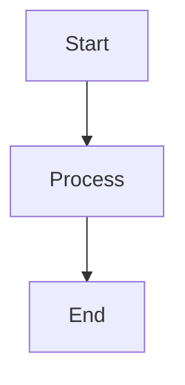

# Diagrams Directory

## Overview

This directory contains visual diagrams and documentation for creating and maintaining project diagrams.

## Diagram Types

### Architecture Diagrams
- System architecture overviews
- Component interaction diagrams
- Data flow diagrams
- Deployment architecture

### Domain Model Diagrams
- Conservation concept relationships
- Miradi domain model visualizations
- Graph schema representations

### Process Flow Diagrams
- ETL pipeline flows
- User interaction flows
- GraphRAG processing flows

## Tools and Standards

### Mermaid Diagrams
Most diagrams in the documentation use Mermaid syntax for version control and easy updates.

**Benefits**:
- Text-based and version controllable
- Renders in GitHub and most documentation platforms
- Easy to update and maintain
- Consistent styling

**Example Structure**:


### External Diagram Tools
For complex diagrams that require more sophisticated layouts:

**Recommended Tools**:
- **Draw.io/Diagrams.net**: Free, web-based, exports to multiple formats
- **Lucidchart**: Professional diagramming with collaboration features
- **Visio**: Microsoft's diagramming tool for enterprise environments

**Export Requirements**:
- Save source files in `docs/diagrams/source/`
- Export to PNG/SVG for documentation embedding
- Include both source and exported versions

## File Organization

```
docs/diagrams/
├── README.md                    # This file
├── source/                      # Source files for external tools
│   ├── architecture.drawio      # Draw.io source files
│   ├── domain-model.vsdx        # Visio source files
│   └── process-flows.lucid      # Lucidchart source files
├── exports/                     # Exported image files
│   ├── architecture-overview.png
│   ├── data-flow-diagram.svg
│   └── graph-schema-visual.png
└── mermaid/                     # Standalone Mermaid files
    ├── system-architecture.mmd
    ├── etl-pipeline.mmd
    └── rag-processing.mmd
```

## Creating New Diagrams

### 1. Choose the Right Tool
- **Simple flowcharts/relationships**: Use Mermaid in documentation
- **Complex layouts**: Use Draw.io or similar tools
- **Collaborative editing**: Use cloud-based tools like Lucidchart

### 2. Follow Naming Conventions
- Use kebab-case for file names
- Include diagram type in name (e.g., `etl-pipeline-flow.mmd`)
- Use descriptive names that indicate content

### 3. Documentation Integration
- Embed diagrams directly in markdown files when possible
- Reference external diagrams with clear captions
- Maintain links between diagrams and related documentation

## Updating Existing Diagrams

### Version Control
- Always update source files first
- Re-export images after changes
- Update documentation references if needed
- Commit source and exported files together

### Change Documentation
- Note significant changes in commit messages
- Update related documentation sections
- Verify diagram accuracy with current implementation

## Diagram Standards

### Color Coding
Use consistent colors across diagrams:
- **Data/Storage**: Green (#4caf50)
- **Processing/Logic**: Blue (#2196f3)
- **External Systems**: Orange (#ff9800)
- **User Interface**: Purple (#9c27b0)
- **Errors/Issues**: Red (#f44336)
- **Warnings**: Yellow (#ffeb3b)

### Typography
- Use clear, readable fonts
- Maintain consistent font sizes
- Ensure text is legible at different zoom levels

### Layout Principles
- Left-to-right or top-to-bottom flow
- Group related elements
- Use whitespace effectively
- Maintain consistent spacing

## Maintenance Schedule

### Regular Reviews
- **Monthly**: Review diagrams for accuracy
- **Release cycles**: Update architecture diagrams
- **Major changes**: Update affected diagrams immediately

### Quality Checks
- Verify diagram accuracy with implementation
- Check for broken links or references
- Ensure consistent styling across diagrams
- Validate export quality and readability

## Best Practices

### Design Principles
1. **Clarity over complexity**: Simplify when possible
2. **Consistency**: Use standard symbols and colors
3. **Accuracy**: Keep diagrams synchronized with implementation
4. **Accessibility**: Ensure diagrams are readable and understandable

### Documentation Integration
1. **Context**: Provide clear captions and context
2. **References**: Link diagrams to related documentation
3. **Updates**: Keep diagrams current with code changes
4. **Alternatives**: Provide text descriptions for accessibility

### Collaboration
1. **Source control**: Always version control source files
2. **Reviews**: Include diagram reviews in code review process
3. **Standards**: Follow established conventions and styles
4. **Communication**: Document significant diagram changes

This directory serves as the central location for all project visualizations, supporting both technical documentation and stakeholder communication needs.
